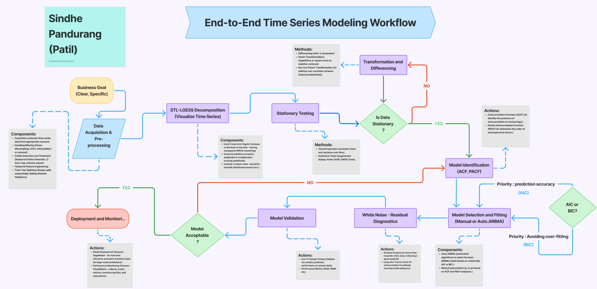

# 📈 Time Series Modeling with ARIMA & SARIMA (NVIDIA)

[](https://www.python.org/)  
[](LICENSE)  
[](https://github.com/your_username/time-series-arima-sarima/stargazers)

---

## 🎯 Motivation

The semiconductor revolution spearheaded by NVIDIA, TSMC and ASML is reshaping technology, economies and geopolitics at unprecedented speed. Accurately forecasting NVIDIA’s stock not only offers actionable investment insights but also demonstrates how classical time-series methods can deliver robust, interpretable predictions in a high stakes, fast evolving market. This project builds a fully reproducible ARIMA/SARIMA pipeline covering data retrieval, rigorous diagnostics, and performance comparison to quantify and anticipate market trends with precision.


---

## 🧩 Why ARIMA/SARIMA?

- **Interpretability**: Coefficients directly reflect autoregressive and moving average components.  
- **Efficiency**: Minimal compute needed for univariate series, unlike deep-learning models.  
- **Seasonality & Trend**: SARIMA captures both seasonal cycles and long-term trends in one framework.  
- **Baseline Reliability**: Provides a robust benchmark before exploring advanced methods (e.g., LSTM, Prophet).

---

## 🚀 Project Goals

- Forecast **NVIDIA (NVDA)** stock closing prices using ARIMA & SARIMA.  
- Compare model performance via **RMSE**, **MAE**, **MAPE**, **AIC**, **BIC**, and **Ljung–Box**.  
- Illustrate a complete workflow:
  1. Data retrieval (Yahoo Finance)  
  2. Exploratory Data Analysis & STL decomposition  
  3. Stationarity tests & differencing (ADF)  
  4. Parameter selection (ACF/PACF, `auto_arima`)  
  5. Model fitting & forecasting  
  6. Residual diagnostics & model selection  

---

## 📦 Requirements

```text
numpy==1.24.4
pandas
yfinance
pmdarima==1.8.5
statsmodels
matplotlib
seaborn
scikit-learn
```
---




## 📚 Overview

This repository includes a Jupyter Notebook and supporting scripts to:

1. Load and visualize historical NVIDIA stock data using **Yahoo Finance**.
2. Decompose the time series into **trend**, **seasonal**, and **residual** components using STL.
3. Conduct **stationarity testing** (ADF test) and apply log differencing.
4. Identify model parameters using **ACF/PACF** plots amd thorugh auto_arima
5. Fit **ARIMA** and **SARIMA** models on log-transformed data.
6. Forecast future stock prices and evaluate accuracy.
7. Diagnose residuals and compare:
   - Error metrics: **RMSE, MAE, MAPE**
   - Information criteria: **AIC, BIC**.
   - Residual Correlation: **Ljung-Box test**
8. Select the best model based on parsimony and performance.

---

## 🚀 How to Run

###  Step 1: Clone the repo
```bash
git clone https://github.com/your_username/time-series-arima-sarima.git
cd time-series-arima-sarima
```
###  Step 2: Install dependencies

Make sure you have Python 3.8+ and pip installed. Then run:

```bash
pip install -r requirements.txt
```
### Step 3: Run the notebook
```bash
Use Jupyter Notebook to open the main notebook:
```
### Step 4: Or run Python scripts
```bash
python scripts/preprocessing.py
python scripts/modeling.py
```
### Step 5: View results
- Figures will be saved in: results/figures/
- Reports, logs, and notes: reports/

---

### 📖 Notes and pdf
The notebook and pdf contains markdown cells that explain:
- What each modeling step is doing
- rationale behind choosing each step and sub-step
- How the diagnostics work
- How metrics were chosen and how i have evalued them.


## ⭐ Support
If you find this project helpful:
Give it a ⭐ star on GitHub


---

## 📑 Key References
1. Box, G. E. P., & Jenkins, G. M. (1976). _Time Series Analysis: Forecasting and Control_. Holden-Day.  
   > The foundational work that formalized the ARIMA modeling framework, including identification, estimation, and diagnostic checking.
   
2. Akaike, H. (1974). A new look at the statistical model identification. _IEEE Transactions on Automatic Control, 19_(6), 716–723.  
   https://doi.org/10.1109/TAC.1974.1100705  
   > Introduced the Akaike Information Criterion (AIC), now widely used for selecting the optimal ARIMA/SARIMA model order.

